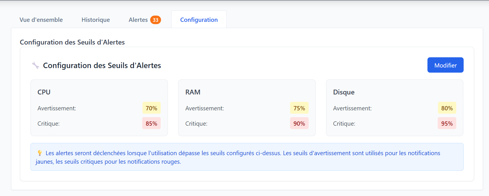

# Système de Surveillance Distribué

**Module :** Systèmes Distribués — **Année :** 2025–2026

Plateforme de monitoring en temps réel : collecte de métriques système, gestion des alertes, et interface web MVC. Le système repose sur une architecture Agent → Serveur → Client avec communication UDP/TCP et RMI.

---

## Prérequis

Avant de lancer quoi que ce soit, vérifiez que vous avez installé :

| Outil | Version |
|-------|---------|
| Java (JDK) | 17+ |
| Maven | 3.8+ |
| Node.js | 18+ |
| npm | 9+ |
| Git | récent |

Vérification rapide :
```bash
java -version
mvn -version
node --version
npm --version
```

---

## Objectifs du projet

- Mettre en place une architecture distribuée complète (Agent → Serveur → Client)
- Utiliser le multi-threading, les sockets TCP/UDP et Java RMI
- Construire une interface moderne avec séparation MVC
- Gérer la concurrence, la persistance et les mises à jour en temps réel

---

## Architecture

| Composant | Rôle | Communication |
|-----------|------|---------------|
| Agent de monitoring | Collecte métriques CPU/RAM/Disque | UDP (métriques), TCP (alertes critiques) |
| Serveur central | Agrège les données, gère les seuils | UDP/TCP + RMI + REST API |
| Interface client | Visualisation, alertes, export, config | Web (REST) et/ou Desktop (RMI) |

---

## Fonctionnalités

- Métriques en temps réel (CPU / RAM / Disque)
- Historique et statistiques
- Alertes configurables par seuil
- Filtrage et recherche
- Gestion des utilisateurs (Admin / Observer)
- Export CSV / JSON

---

## Stack technique

| Couche | Technologies |
|--------|--------------|
| Core | Java 17, Maven, Threads, `java.net`, `java.rmi` |
| Serveur | Spring Boot, UDP/TCP, RMI, H2 |
| Client Web | React 18, Vite, TailwindCSS, Axios, Recharts |
| Outils | Git, JUnit, PlantUML |

---

## Structure du projet

```
Distributed_Systems_Project-/
├── shared/                          # Modèles, constantes et utilitaires partagés
│   └── src/main/java/com/monitor/shared/
│       ├── model/                   # MetricData, Alert, User, Role, AgentStatus
│       ├── rmi/                     # Interface RMIMetricsService
│       ├── constants/               # NetworkConstants, ThresholdConstants
│       └── utils/                   # Logger, SerializationUtils
│
├── agent/                           # Agent de monitoring (UDP sender, TCP alert client)
│   └── src/main/java/com/monitor/agent/
│       ├── core/                    # AgentMain, MonitoringAgent, SystemMetricsCollector
│       ├── network/                 # UDPSender, TCPAlertClient
│       └── threads/                 # MetricPublisherTask
│
├── server/                          # Serveur central (Spring Boot)
│   └── src/main/java/com/monitor/server/
│       ├── core/                    # ServerMain, ConcurrentDataStore
│       ├── network/                 # UDPServer, TCPServer
│       ├── alerting/                # ThresholdEngine, AlertDispatcher
│       ├── rmi/                     # RMIServer, RMIMetricsServiceImpl
│       ├── rest/                    # MetricsController, AdminController
│       ├── storage/                 # MetricsRepository (H2), MetricsExporter
│       ├── security/                # AuthService
│       └── config/                  # SecurityConfig, ServerInitializer
│
├── client-desktop/                  # Client Desktop (Swing + RMI + REST)
│   └── src/main/java/com/monitor/ui/desktop/
│       ├── main/                    # Point d'entrée DesktopApp
│       ├── controller/              # DashboardController
│       ├── view/                    # DashboardView (onglets Swing)
│       └── rmi/                     # RMIServiceProxy
│
├── client-web/                      # Client Web (React + Vite + Tailwind)
│   ├── src/
│   │   ├── main.jsx
│   │   ├── App.jsx                  # Dashboard avec onglets Métriques / Historique / Alertes
│   │   ├── api/api.js               # Appels REST via Axios
│   │   └── components/
│   │       ├── MetricsTable.jsx
│   │       ├── AlertsTable.jsx
│   │       └── AgentChart.jsx       # Graphiques Recharts
│   └── index.html
│
├── docs/
│   ├── architecture.md
│   ├── guide-utilisation.md
│   └── uml/
│
├── scripts/
│   ├── build-all.sh
│   ├── start-server.sh
│   ├── start-agent.sh
│   └── run-tests.sh
│
└── pom.xml
```

---

## Lancer le projet

### Étape 1 — Cloner le dépôt

```powershell
cd Downloads
git clone https://github.com/OualidDR/Distributed_Systems_Project- Distributed_Systems_Working_test
cd Distributed_Systems_Working_test
```

### Étape 2 — Compiler les modules

```powershell
mvn --% -f shared\pom.xml clean install
mvn --% -f agent\pom.xml clean package
mvn --% -f server\pom.xml clean package
```

> **Important :** toujours compiler `shared` en premier, sinon les autres modules ne trouvent pas les classes communes.

### Étape 3 — Installer les dépendances front

```powershell
cd client-web
npm install
cd ..
```

### Étape 4 — Lancer les 3 composants (3 terminaux séparés)

**Terminal 1 — Serveur**
```bash
mvn --% -f server\pom.xml spring-boot:run -Dspring-boot.run.mainClass=com.monitor.server.core.ServerMain
```

**Terminal 2 — Agent**
```bash
java -jar agent\target\agent-1.0-SNAPSHOT.jar
```

**Terminal 3 — Interface web**
```bash
cd client-web
npm run dev
```

---

## Points d'accès

| Service | URL |
|---------|-----|
| Interface web | http://localhost:3000 |
| API REST | http://localhost:8080/api |
| WebSocket | ws://localhost:8080/ws |

---

## Problèmes fréquents

**`Unable to access jarfile agent/target/agent-1.0-SNAPSHOT.jar`**  
L'agent n'a pas été compilé. Relancer les commandes Maven dans l'ordre (shared → agent).

**`Cannot find module 'autoprefixer'`**  
```bash
cd client-web
npm install autoprefixer
```

**`NoClassDefFoundError: com/monitor/shared/utils/Logger`**  
Le module shared n'est pas dans le dépôt local Maven. Refaire `mvn -f shared\pom.xml clean install`.

**Conflit de ports**  
Le serveur tourne par défaut sur 8080 et le front sur 3000. Si un de ces ports est déjà utilisé, modifier la config correspondante avant de relancer.

---

## Aperçu



