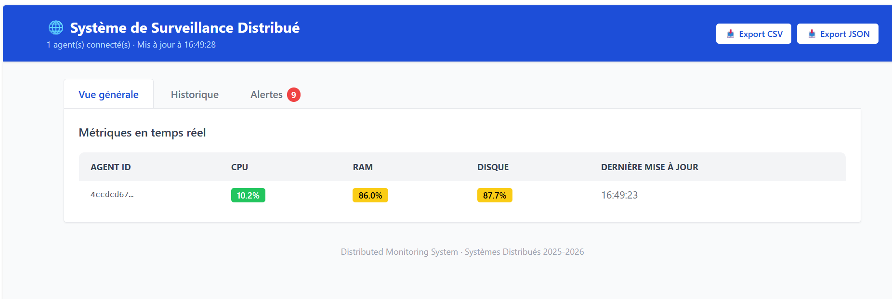
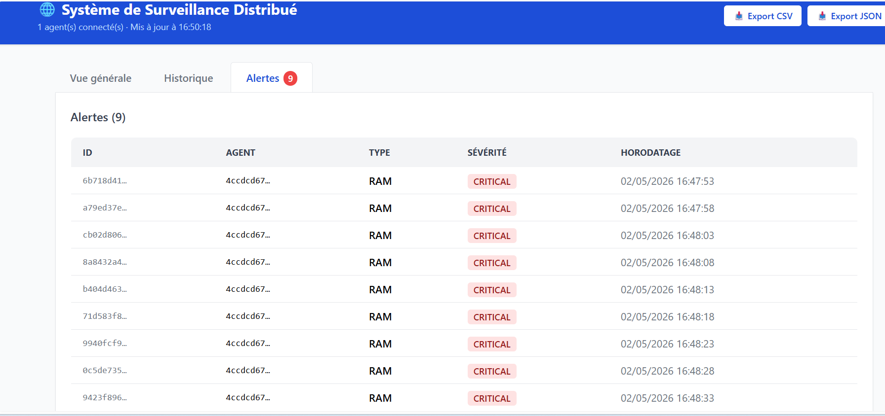

# 🌐 Distributed Monitoring System

**Course:** Distributed Systems — **Academic Year:** 2025–2026  
A real-time distributed platform for collecting, processing, and visualizing system metrics, managing alerts, and providing a modern MVC interface.

---

## 🎯 Context & Learning Objectives
This project demonstrates a complete distributed system with real-time monitoring.

**Objectives**
- Implement a distributed architecture (Agent → Server → Client)
- Use multi-threading, TCP/UDP networking, and Java RMI
- Build a modern UI with MVC principles
- Separate backend and frontend responsibilities
- Handle concurrency, persistence, and real-time updates

---

## 🏗️ System Architecture

| Component | Role | Communication |
|----------|------|---------------|
| **Monitoring Agent** | Collects CPU/RAM/Disk metrics | UDP for metrics, TCP for critical alerts |
| **Central Server** | Aggregates data, manages agents, evaluates thresholds | UDP/TCP listeners, RMI services, REST API |
| **Client UI** | Visualizes data and alerts, export, configuration | Web (REST) and/or Desktop (RMI) |

---

## ✅ Key Features

- **Real-time Metrics** (CPU / RAM / Disk)
- **History & Statistics**
- **Configurable Alerts**
- **Filtering & Search**
- **User Management** (Admin / Observer)
- **Export CSV / JSON**

---

## 🧰 Tech Stack

| Layer | Technologies |
|------|--------------|
| **Core** | Java 17, Maven, Threads, `java.net`, `java.rmi` |
| **Server** | Spring Boot, UDP/TCP, RMI, H2 |
| **Client (Web)** | Vite + (React/Vue/Angular) |
| **Tools** | Git, JUnit, Mermaid/PlantUML |

---

## 📂 Project Structure

```
Distributed_Systems_Project-/
├─ server/              # Spring Boot server (REST + RMI + UDP/TCP)
├─ agent/               # Monitoring agent
├─ client-web/          # Web UI
└─ scripts/             # Start scripts
```

---

## ▶️ How to Run

### 1) Server
```powershell
cd Distributed_Systems_Project-
mvn --% -f server\pom.xml spring-boot:run -Dspring-boot.run.mainClass=com.monitor.server.core.ServerMain -Dspring-boot.run.arguments="--spring.autoconfigure.exclude=org.springframework.boot.autoconfigure.security.servlet.SecurityAutoConfiguration"
```

### 2) Agent
```bash
./scripts/start-agent.sh
```

### 3) Web UI
```powershell
cd client-web
npm install
npm run dev
```
```
## 📸 Screenshots



---


